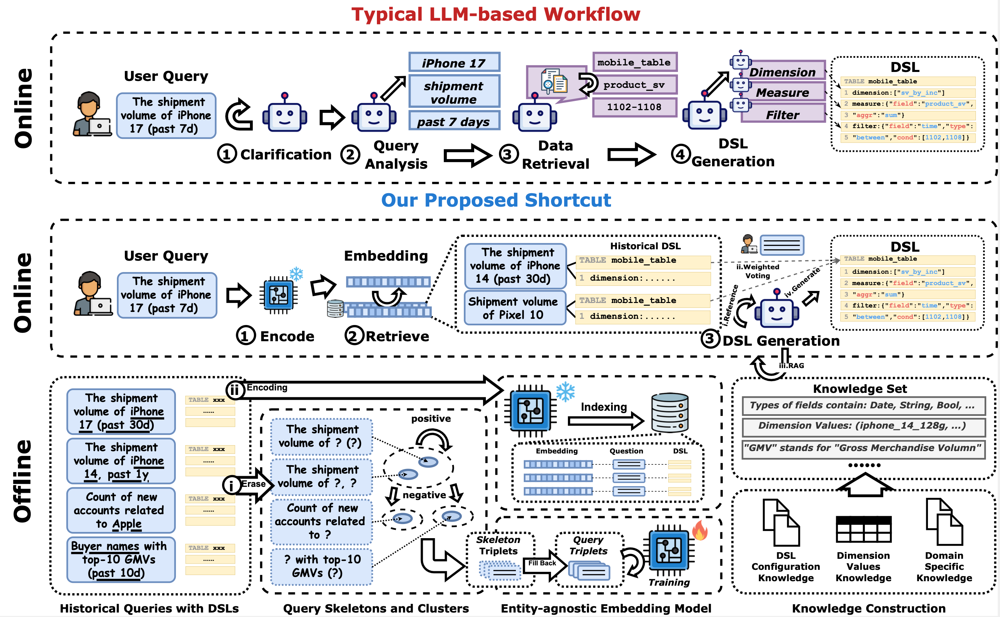

# 🚀 RedParrot: Accelerating NL-to-DSL for Business Analytics via Query Semantic Caching

This repository contains the code and datasets for the paper "RedParrot: Accelerating NL-to-DSL for Business Analytics via Query Semantic Caching".

> **Note on Availability:** A portion of the source code and all in-house datasets are currently undergoing an internal review process. They will be released publicly upon approval.

## 💻 Code

The source code for our project is provided in this repository.

## 📚 Datasets

We evaluated our model on two types of datasets:

1.  **In-house Datasets (Currently Private)**: Six datasets were built from real operational data at Xiaohongshu. These are pending release after an internal review.
2.  **New Public Benchmarks**: We introduce two new benchmarks, **Spider-DSL** and **BIRD-DSL**, which are synthesized from the popular Text-to-SQL datasets Spider and BIRD. These are available in this repository.

## 📄 Supplementary Appendix

For more technical details, please refer to the [appendix.pdf](./appendix.pdf) included in this repository. The appendix provides comprehensive documentation on the following:

* [cite_start]**System Deployment Architecture**: A deep dive into our dual-path execution strategy (Short-chain and Long-chain) managed by a DAG-based workflow engine and modular microservices.
* [cite_start]**Cache Updating Strategy**: A quantitative comparison between full rebuilds and our proposed **incremental update strategy**. [cite_start]The incremental approach achieves an average **3.7x speedup** (up to 5.13x in specific domains) by utilizing connectivity-based filtering.
* [cite_start]**Skeleton Validation (LLM-as-a-Judge)**: Details of our discriminative validation framework. [cite_start]Using Chain-of-Thought (CoT) reasoning, this mechanism attains **98% extraction accuracy** on production datasets.
* [cite_start]**Comprehensive Error Analysis**: A statistical breakdown of failure patterns, including **Erroneous Field Mapping (39%)**, **Configuration Rule Violations (38%)**, **Calculation Logic Errors (17%)**, and **Wrong Table Mappings (6%)**.

## 🤝 Acknowledge
This work was conducted as part of a research collaboration between **Zhejiang University** and **Xiaohongshu**. We thank our colleagues from both institutions for their valuable feedback and support.